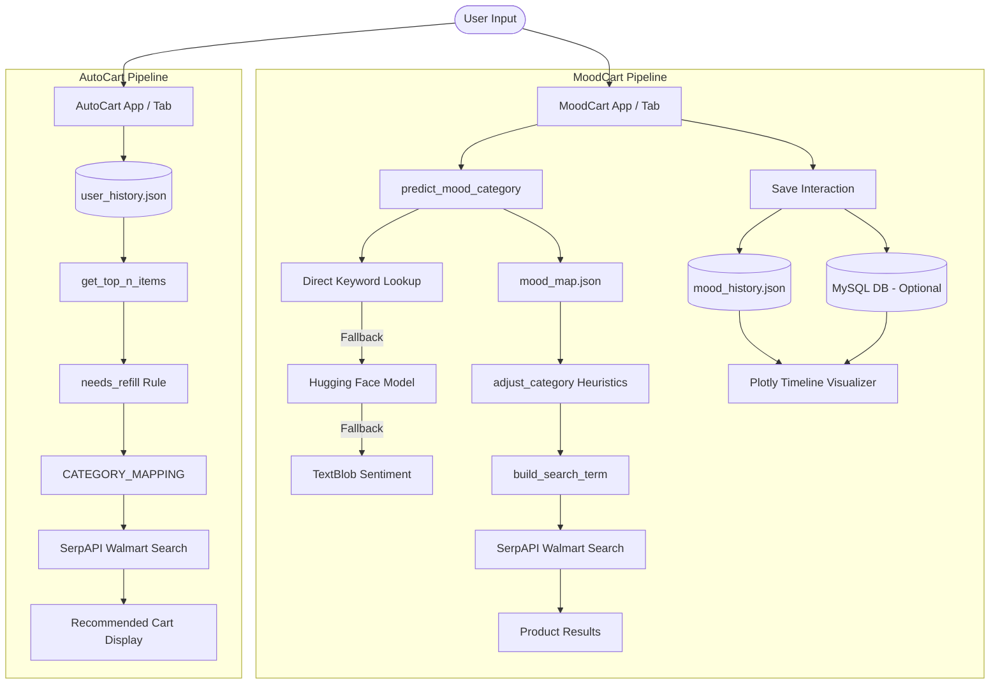

# CartVerse
## *Walmart Innovation Suite*

> **About this project:** **CartVerse** (part of the **Walmart Innovation Suite**) is an advanced retail prototype built for **Walmart Sparkathon 2025** (Walmart's annual hackathon). It showcases next-generation personalized shopping experiences.

**CartVerse** is a Streamlit-powered shopping assistant that personalizes Walmart product discovery in two ways:
- 🧠 **MoodCart**: Turns what you feel into product categories and recommends items that fit your mood.
- 🤖 **AutoCart**: Mines past shopping behavior to suggest refills and trending alternatives automatically.

Both modules can run on their own or through the combined `main_app.py` experience.

---

## Why This Project Exists
Traditional e-commerce platforms rely heavily on search queries and generic recommendations, often ignoring a customer's current emotional state or their underlying shopping habits. This can lead to decision fatigue. **CartVerse** (via the **Walmart Innovation Suite**) aims to solve this by introducing:
1. **Emotional Personalization**: Translating emotional states into relevant product categories.
2. **Habit-Based Automation**: Analyzing past behavior to predict when items need replenishment, reducing cognitive load.

---

## Key Features
- **Mood Detection with Fallback Chain**: Evaluates user emotions using a layered approach: direct keyword matching, a HuggingFace DistilBert classifier, and a TextBlob polarity fallback.
- **Age/Interest/Gender-Based Category Adjustment**: Adapts product categories dynamically based on demographic heuristics (e.g., matching "toys" to "educational toys for kids" for children or "collectibles or hobby kits for adults" for adults).
- **SerpAPI Product Search with Retry**: Queries real-time Walmart search results using SerpAPI, featuring custom rate-limit handling and automatic retries.
- **Mood History Timeline**: Tracks and visualizes user emotions over time using Plotly, complete with 7-day, 30-day, and all-time filters.
- **AutoCart Frequency-Based Recommendations**: Computes purchase frequency from local history files to rank and recommend common items.

---

## Architecture
**CartVerse** (the **Walmart Innovation Suite**) provides three Streamlit entry points:
1. `main_app.py` (Combined): A unified portal housing both MoodCart and AutoCart under a tabbed, Walmart-themed interface.
2. `MOODCART/app.py` (Standalone): A standalone interface focused entirely on the mood-based discovery flow.
3. `AUTOCART/app.py` (Standalone): A standalone interface focused entirely on past purchase history analysis and product replenishment.

### Data Flow & Persistence


---

## Tech Stack
- **Streamlit (v1.33.0)**: Used as the core framework for building clean, interactive web interfaces.
- **pandas (v2.2.1)**: Powers data manipulation, history analysis, and structure building for visualization.
- **plotly (v5.21.0)**: Generates the interactive mood history timeline charts.
- **transformers (v4.41.1)**: Runs the HuggingFace `distilbert-base-uncased-emotion` model for sentiment analysis.
- **textblob (v0.18.0)**: Serves as the backup sentiment analyzer calculating text polarity.
- **mysql-connector-python (v8.3.0)**: Establishes optional database connections to store and load mood history.
- **requests (v2.31.0)**: Performs HTTP requests to query SerpAPI Walmart search endpoints.
- **SerpAPI**: The third-party API service used to search and retrieve live Walmart products.
- **python-dotenv (v1.0.1)**: Loads sensitive API keys and database credentials from environment configuration files.
- **nest_asyncio (v1.6.0)**: Enables running nested asynchronous tasks inside Streamlit's event loops.

---

## Engineering Decisions
### 1. Robust Sentiment Fallback Chain
Due to the computational overhead and potential networking or startup issues with machine learning models, **CartVerse** implements a 3-tier fallback chain:
1. **Direct Keyword Lookup**: Fast regex search against explicit emotions listed in `mood_map.json`.
2. **HuggingFace Pipeline**: A pre-trained `distilbert-base-uncased-emotion` model for semantic classification.
3. **TextBlob Polarity**: A local, rules-based sentiment calculation that infers generic joy, sadness, or neutral states if the ML pipeline fails.

### 2. Contextual Category Adjustment (Demographic Heuristics)
To prevent recommending children's toys to adults or adult collectibles to kids, category outputs are modified at runtime. By evaluating age, gender, and primary interest, the backend maps generic keywords to precise subcategories (e.g., mapping `sports equipment` + `Female` to `sports gear for women`).

---

## AI Components
### Emotion Classification
- **Model**: `bhadresh-savani/distilbert-base-uncased-emotion`
- **Fallback**: TextBlob polarity-based categorization.

### Category Mapping Table (`mood_map.json`)
The primary lookup table maps specific input emotions to initial search categories:

| Detected Mood | Mapped Category | Detected Mood | Mapped Category |
| :--- | :--- | :--- | :--- |
| **joy** | toys | **happiness** | party supplies |
| **sadness** | books | **anger** | boxing gloves |
| **fear** | security gadgets | **nervous** | self-help books |
| **underconfident** | motivational books | **demotivated** | productivity tools |
| **surprise** | gifts | **neutral** | essentials |
| **love** | romantic gifts | **boredom** | games |
| **excitement** | electronics | **confusion** | self-help books |
| **loneliness** | home decor | **relaxed** | candles |
| **energetic** | sports equipment | **frustration** | stress relief toys |
| **anxiety** | wellness products | **hopeful** | stationery |
| **determined** | fitness gear | **motivated** | productivity tools |
| **calm** | tea and coffees | **nostalgic** | retro items |
| **curious** | educational kits | **grateful** | thank-you gifts |

---

## Database Design
**CartVerse** supports optional persistent database storage for mood history logs.

```sql
CREATE TABLE IF NOT EXISTS mood_history (
    id INT AUTO_INCREMENT PRIMARY KEY,
    user_id VARCHAR(50) NOT NULL,
    timestamp DATETIME NOT NULL,
    mood VARCHAR(50) NOT NULL,
    category VARCHAR(100) NOT NULL,
    adjusted_category VARCHAR(150) NOT NULL,
    interest VARCHAR(100),
    age INT,
    gender VARCHAR(50)
);
```

If database connection environment variables are not supplied or fail to connect, the application gracefully defaults to caching transactions inside `mood_history.json`.

---

## User Flow
### 🧠 MoodCart Tab
1. **Personalization Sidebar**: The user inputs their age, selects an interest (e.g., Technology, Gaming), and chooses their gender.
2. **Text Input**: The user describes their mood (e.g., "I feel extremely tired and anxious").
3. **Recommendation Generation**: Upon clicking "Get Recommendations":
   - The app runs the sentiment fallback chain.
   - The category is adjusted according to user details.
   - History logs save to the database and `mood_history.json`.
4. **Insights & Timeline**: The user can open expanders to view past records and inspect their Plotly mood history chart.
5. **Product Display**: Up to 5 matching products are loaded and displayed in a two-column grid.

### 🤖 AutoCart Tab
1. **Product Search**: A manual search input bar allows direct query searches on Walmart.
2. **User Selector**: A dropdown lets the operator select one of the mock users (e.g., `user_1` to `user_10`) defined in `user_history.json`.
3. **Generate Recommendations**: Upon activation:
   - AutoCart parses the user's historical purchases.
   - It identifies the most frequent items.
   - It queries SerpAPI for trending alternatives and maps them to coarse categories.
   - A personalized replenishment list is displayed.

---

## Folder Structure
```
CartVerse/
├── .env.example                # Sample environment configuration file
├── .gitignore                  # Git untracked file settings
├── mood_history.json           # Local JSON fallback cache for mood inputs
├── main_app.py                 # Core integrated Streamlit application
├── requirements.txt            # System dependencies manifest
├── schema.sql                  # Database table definitions
├── AUTOCART/
│   ├── __init__.py
│   ├── app.py                  # Standalone AutoCart Streamlit page
│   ├── autocart_engine.py      # Recommendations processing engine
│   ├── autocart_rules.py       # Helper functions and category mappings
│   ├── user_history.json       # Purchase histories for mock users
│   ├── walmart_api.py          # SerpAPI communication library
│   └── autocart_results.json   # Exported results cache
└── MOODCART/
    ├── __init__.py
    ├── app.py                  # Standalone MoodCart Streamlit page
    ├── mood_map.json           # Sentiment-to-category associations
    └── moodcart_model.py       # Multi-tiered classification model
```

---

## Installation Guide
1. **Clone the Repository** and navigate to the root directory.
2. **Install Dependencies**:
   ```bash
   pip install -r requirements.txt
   ```
3. **Download TextBlob Corpora** (Required for fallback sentiment analyzer):
   ```bash
   python -m textblob.download_corpora lite
   ```

---

## Environment Variables
Copy `.env.example` to a new file named `.env` and fill in the values:

```ini
SERPAPI_KEY=your_serpapi_api_key_here
MOODCART_DB_HOST=your_mysql_database_host_here
MOODCART_DB_USER=your_mysql_database_user_here
MOODCART_DB_PASSWORD=your_mysql_database_password_here
MOODCART_DB_NAME=your_mysql_database_name_here
```

- `SERPAPI_KEY`: Required. Your SerpAPI access key for executing live Walmart searches.
- `MOODCART_DB_*`: Optional. MySQL parameters to activate historical database logging.

---

## Running The Project
Ensure you are inside the root directory `CartVerse/`.

### 1. Running the Integrated Experience (Recommended)
This runs the full suite containing both tabs:
```bash
streamlit run main_app.py
```

### 2. Running Standalone Standalone Apps
To run the standalone components individually:

- **AutoCart Standalone**:
  ```bash
  streamlit run AUTOCART/app.py
  ```
  *(Note: This application expects to be run from the root directory to properly resolve sub-package imports).*

- **MoodCart Standalone**:
  Since `MOODCART/app.py` references its model as `from moodcart_model import ...`, run it with the `MOODCART` folder included in your python search path:
  
  *PowerShell (Windows)*:
  ```powershell
  $env:PYTHONPATH="MOODCART"; streamlit run MOODCART/app.py
  ```
  
  *Command Prompt (Windows)*:
  ```cmd
  set PYTHONPATH=MOODCART&& streamlit run MOODCART/app.py
  ```
  
  *Linux / macOS*:
  ```bash
  PYTHONPATH=MOODCART streamlit run MOODCART/app.py
  ```

---

## Deployment Guide
To deploy **CartVerse** (Streamlit app):
1. **Environment Variables**: Configure the system variables (e.g. `SERPAPI_KEY`, `MOODCART_DB_HOST`, etc.) inside your hosting provider's Secrets configuration panel.
2. **Database Integration**: Ensure your target MySQL database is reachable by your hosting environment, or rely entirely on the automatic local file (`mood_history.json`) fallback.
3. **HuggingFace Pipeline**: Ensure the hosting environment has adequate memory allocations to download and cache the `distilbert-base-uncased-emotion` model upon initialization.

---

## Screenshots
### MoodCart Tab
.png)
.png)

### Mood Timeline Chart
.png)

### AutoCart Tab
.png)
.png)
.png)

---

## Performance Considerations
- **API Caching**: All product lookups are cached locally using Streamlit's `@st.cache_data(ttl=3600)` decorator to save API quota and accelerate repeat queries.
- **SerpAPI Retry Handling**: To handle API rate limits, the request client uses retry loops (`fetch_products_with_retry`) backstaged by delay buffers when encountering `429 Too Many Requests` responses.
- **Lazy Model Loading**: The ML pipeline classifier is loaded lazily via a module-level singleton (`get_emotion_classifier()`) to ensure fast application startup times.

---

## Security Considerations
- **Secure Credentials**: All authorization keys and database parameters have been removed from the source code and are managed exclusively via environment variables loaded by `python-dotenv`.
- **Git Protection**: The local `.env` configuration file is gitignored to prevent credentials from leaking into public code repositories.
- **Safe SerpAPI Client**: All search inputs are normalized and escaped before transmission to SerpAPI.

---

## Challenges Solved
- **Rate-Limit Resilience**: Solved random connection drops and rate limits in SerpAPI calls through structured retry routines and memory caching.
- **Model Size vs. Performance**: Leveraged a multi-tiered fallback architecture to bypass loading heavy machine-learning classifiers if environment resources are constrained.
- **Unified Pathing**: Handled nested import and resource-path issues across standalone and integrated entry points using absolute parent path resolvers (`Path(__file__).parent`).

---

## Future Scope
*These items represent the current backlog and developmental gaps:*

- `needs_refill` is stubbed to always return `True`; add real refill logic based on recency or quantity.
- SerpAPI errors are surfaced in the UI; consider broader rate-limit backoff and logging.
- Add tests around mood mapping, refill logic, and SerpAPI parsing as the logic evolves.

---

## Lessons Learned
- **Multi-tiered redundancy is key**: Developing local lexicon-based checks alongside transformer models ensures high application availability and minimizes API dependency.
- **Path structure awareness**: Building relative directories based on `Path(__file__)` rather than OS-dependent string concatenation prevents execution errors across different environments.

---

## Resume Highlights
- **Prototype Scale**: Developed a modular e-commerce personalizer featuring three runtime entry points, complex demographic filtering, and dual-layer local/database persistence.
- **Machine Learning Integration**: Designed and deployed a multi-stage classification pipeline running HuggingFace DistilBert transformers with TextBlob lexicon-based fallbacks.
- **API and Database Architecture**: Structured external data querying via SerpAPI with custom rate-limiting retry policies, combined with an optional relational MySQL database logger.

---

## Contribution Guidelines
If you would like to contribute:
1. **Fork** the repository.
2. Create a new **feature branch** (`git checkout -b feature/NewFeature`).
3. Commit your changes (`git commit -m 'Add NewFeature'`).
4. **Push** to the branch (`git push origin feature/NewFeature`).
5. Open a **Pull Request**.

---

## License
This project is licensed under the MIT License - see the LICENSE file for details.
